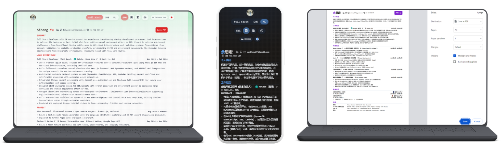

# ShYu Resume

<div align="right">
  <a href="README.md">English</a> | <a href="README.zh.md">简体中文</a>
</div>



A bilingual (EN/ZH) resume builder built with Next.js, featuring job-aware content tailoring and one-click PDF export with smart pagination.

## Features

- **Bilingual** — Switch between English and Simplified Chinese seamlessly
- **Job-Aware Content** — 4 profiles (SWE, SRE, AI/MR, NONE) with tailored summary, work experience, and projects for each
- **One-Click PDF Export** — Smart pagination that keeps content on-page, with clickable hyperlinks preserved
- **Dark / Light Mode** — Comfortable viewing in both themes
- **Self-Hosted Font** — LXGW WenKai font loaded locally via `next/font` for consistent rendering across devices
- **Mobile-Friendly** — Responsive layout that works on all screen sizes
- **Multi-Platform Deployment** — GitHub Pages, Vercel, Cloudflare Pages

## Getting Started

### Prerequisites

- Node.js 18+
- npm or yarn

### Installation

```bash
npm install
npm run dev
```

Open [http://localhost:3000](http://localhost:3000) in your browser.

### Build for Static Export

```bash
npm run build
```

The static output will be in the `out/` directory, ready for deployment to GitHub Pages, Vercel, or Cloudflare Pages.

## Project Structure

```
content/
  config.ts         — Personal info, site config, localization helpers
  copy.ts           — UI labels and localization strings
  en/               — English resume content
    summary.ts
    work-experience.ts
    projects.ts
    skills.ts
    education.ts
  zh/               — Simplified Chinese resume content
    summary.ts
    work-experience.ts
    projects.ts
    skills.ts
    education.ts
styles/
  globals.css       — Tailwind directives and global styles
  variables.css     — CSS custom properties (colors, fonts)
  base.css          — Base element resets and typography
  resume.css        — Resume-specific layout classes
  background.css    — Background pattern styles
  utilities.css     — Utility classes
  print.css         — Print-specific overrides
components/
  section/          — Section, Experience, header, summary, skills, etc.
  labels/           — Label, LabelWithLink, LabelWithGraphic
  lang/             — Language provider
  job/              — Job type provider and switcher
  theme/            — Theme provider
public/
  fonts/            — Self-hosted font files
  images/           — Company logos, icons, banner
```

## Content Customization

### Personal Info & Site Config

Edit `content/config.ts`:

- Name, contact details (email, phone, LinkedIn, GitHub, WeChat)
- Site title, description, keywords
- Language-specific name layout (first/last name order)

### Resume Content

Each language folder (`content/en/`, `content/zh/`) contains:

| File | Description |
|------|-------------|
| `summary.ts` | Personal summary for each job profile |
| `work-experience.ts` | Work history with job-type filtering |
| `projects.ts` | Project portfolio (2 highlights per project) |
| `skills.ts` | Skills categorized by domain |
| `education.ts` | Educational background |

### Copy & Localization

Edit `content/copy.ts` to customize:

- UI labels (section titles, button text, tooltips)
- Language-specific layout preferences (name order, contact info)
- Theme switcher, job switcher labels

## Tech Stack

- Next.js 14 (static export)
- React 18
- TypeScript
- Tailwind CSS
- Framer Motion

## License

This project is open source under the [MIT License](LICENSE).