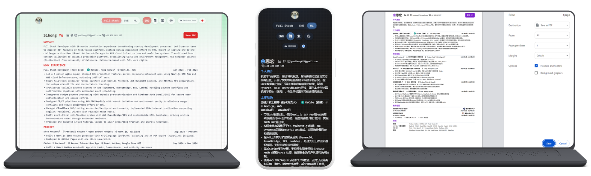

# ShYu 履歷

<div align="right">
  <a href="README.md">English</a> | <a href="README.zh.md">简体中文</a> | <a href="README.zh-hk.md">繁體中文</a>
</div>



一個現代化的雙語履歷構建器，使用 Next.js 和 React 構建，為網頁和 PDF 格式進行了優化。這個專案是 [Markdown-React-Resume](https://github.com/Crayon-ShinChan/mr-resume) 的增強版本，旨在創建專業的履歷，在 HR 和 ATS 系統中脫穎而出。

## 📄 PDF 生成

1. 在 Chrome 中打開你的履歷
2. 點擊頁面上的 **儲存PDF** 按鈕（由 Action Button 元件提供）
3. 列印對話框會自動打開
4. 選擇 **另存為 PDF** 作為目標
5. 點擊 **儲存** 下載你的履歷為 PDF 格式

> **重要提示**：為獲得最佳的 PDF 輸出（版面與連結保留），請使用 Chrome，並在列印對話方塊中選擇「另存為 PDF」。其他瀏覽器（Edge、Firefox 等）可能呈現不同。行動裝置瀏覽器可能無法完全支援自訂字型。建議啟用背景圖形並將邊距設為「無」。

## ✨ 特性

- **雙語支援**：創建中文（簡體和繁體）和英文履歷
- **優化的 PDF 佈局**：完美的 A4 格式，具有適當的分頁和樣式
- **響應式設計**：在桌面和移動設備上都看起來很棒
- **主題定制**：紅色主題，帶有可定制選項
- **內容分離**：所有文本內容存儲在組織良好的 `content` 資料夾中，便於編輯
- **ATS 友好**：為 Applicant Tracking Systems 優化
- **基於工作的關鍵詞高亮**：根據選擇的工作類型自動高亮相關技能和經驗
- **專案過濾**：動態過濾專案，只顯示與所選工作類型相關的專案
- **列印為 PDF**：一鍵生成 PDF 格式，格式正確

## 🚀 開始使用

解鎖履歷定制實戰！基於 yunjin-resume [分支](https://github.com/shyu216/shyu-resume/tree/yunjin-resume)與[網頁](https://shyu216.github.io/shyu-resume/yunjin-resume/) 模板，[需完成 50+ 文件深度改造](https://github.com/shyu216/shyu-resume/pull/1)，覆蓋內容語言適配、工作種類重構全維度。這不僅是一次履歷定制練習，更是上手 NextJS 開發、玩轉 GitHub CI/CD 自動化部署的絕佳實戰機會，從代碼修改到流程配置，全程實操吃透前端工程化核心技能，快來動手試試！

### 先決條件

- Node.js 18+
- npm 或 yarn

### 安裝

1. 安裝依賴
   ```bash
   npm install
   # 或
   yarn install
   ```
2. 啟動開發伺服器
   ```bash
   npm run dev
   # 或
   yarn dev
   ```
3. 在瀏覽器中打開 [http://localhost:3000](http://localhost:3000)

### 編輯內容

所有履歷內容都存儲在 `content` 資料夾中，按語言組織：

- `content/config.ts` - 配置文件，包含網站元數據、個人資訊、聯絡方式等
- `content/en/` - 英文內容
- `content/zh/` - 簡體中文內容
- `content/zh-hk/` - 繁體中文內容

只需編輯這些資料夾中的 TypeScript 檔案即可更新你的履歷資訊。

### 主題定製

修改以下文件中的主題設定來自訂顏色和樣式：

| 文件 | 說明 |
|------|------|
| `lib/theme-config.ts` | 顏色配置 (colorPalettes)、字體配置 |
| `components/color/color-provider.tsx` | 默認主題顏色設置 |
| `components/font/font-provider.tsx` | 默認字體設置 |

### 基於工作的功能

履歷構建器包含智能的基於工作的功能：

1. **工作類型選擇**：使用介面中的工作切換器選擇你申請的工作類型
2. **關鍵詞高亮**：自動高亮與所選工作類型相關的技能和經驗
3. **專案過濾**：動態過濾你的專案，只顯示與所選工作類型最相關的專案

### 自訂工作類型

要添加或修改工作類型及其相關關鍵詞：

1. 在 `components/job/job-switcher.tsx` 中編輯工作類型
2. 在 `components/job/job-stack-keywords.ts` 中更新關鍵詞映射

### AI 驅動的關鍵詞生成

關鍵詞匹配系統由 AI 增強。在編寫完工作經驗和專案後，你可以：

1. 打包你的履歷內容（工作經驗和專案）
2. 將其發送給 AI 助手，如豆包
3. 請求它生成一個全面的 `keywords.json` 檔案
4. 用生成的檔案替換現有的 `app/keywords.json` 檔案

這個 AI 生成的關鍵詞列表將幫助優化你的履歷以適應不同的工作類型，並提高 ATS 兼容性。

你也可以修改 `scripts/gen-keywords.js` 檔案來自訂關鍵詞生成過程。這個腳本會被 workflow 調用，但具體實現細節仍在完善中。歡迎發揮你的才智，實現自己的關鍵詞生成邏輯！

## 🤝 貢獻

歡迎貢獻！如果你有改進或錯誤修復的想法，請：

1. Fork 倉庫
2. 創建一個新分支 (`git checkout -b feature/your-feature`)
3. 進行你的更改
4. 提交你的更改 (`git commit -m 'Add your feature'`)
5. 推送到分支 (`git push origin feature/your-feature`)
6. 打開一個 Pull Request

## 📚 技術棧

- Next.js 14
- React 18
- TypeScript
- Tailwind CSS
- Framer Motion（用於動畫）

## 📄 許可證

這個專案是開源的，在 [MIT License](LICENSE) 下可用。

## 🌟 顯示你的支持

如果你發現這個專案有幫助，請在 GitHub 上給它一個 ⭐️！

---

用 ❤️ 構建 by ShYu

---
